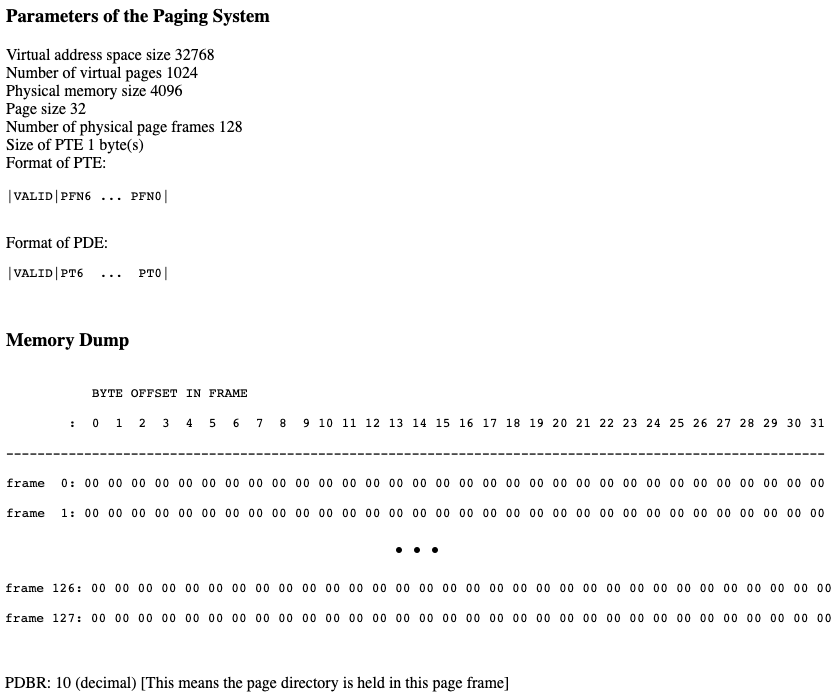

# Multi Level Address Translation

This is a virtual address translation tool. It performs the translation from a virtual address to a physical one, for some dummy memory examples which asks you to perform a virtual address trace.

This might look something like this:



## Setup

This C script requires setting up some given parameters of the paging system in `vaddr_input.h` to function.

```
int VADDR_SIZE      = 32768;
int NUM_PAGES       = 1024;
int PHYS_MEMSIZE    = 4096;
int PAGE_SIZE       = 32;
int NUM_PG_FRAMES   = 128;
int PTEBYTES        = 1;
int PBDR            = 10;

unsigned int FRAMES [128][32] = {...}
```

## Run

After setup, compile the C code with a `make`, then, in the terminal, run the script with two args: the virtual address, and the base that it is input as.

In our example, `./multiaddr 0x204f 16` is used for this virtual address in base 16 (hex, as is evident by the prefix `0x`).

## Output

The resulting output shows the values at each stage up to the final physical address. It is a little verbose, but does so to provide enough info and numbers to allow one to check each step thoroughly. It will also display `Fault!` if at some point a page fault occurs.

For this example, the virtual address of `0x204f` is translated to a physical address of `0x42f` with a value of `0xf`.

```
Num Offset Bits: 5 
Num Virtual Pages: 1024 
Num VPN Bits: 10 bits
Num Physical Pages (Page Frames): 128 
Num Physical Bits: 7 bits
Num Physical Address Bits: 12 
----------------------------------------------------------------
---------------------------------------------------
00. VADDR: 0x204f 
num:  8271 (0x204f)
bits: 0010 0000 0100 1111 

Offset: 
num:  15 (0xf)
bits: 0 1111 

PBDR (first frame): 10

---------------------------------------------------
01. PAGE DIR INDEX:
num:  8 (0x8)
bits: 0 1000 

PAGE DIR ENTRY w/ Check @ [10][8]:
num:  233 (0xe9)
bits: 1110 1001 

PAGE DIR ENTRY: 
num:  105 (0x69)
bits: 0110 1001 

---------------------------------------------------
02. PAGE TABLE BITS:
num:  2 (0x2)
bits: 0 0010 

PAGE TABLE ENTRY w/check @ [105][2]:
num:  161 (0xa1)
bits: 1010 0001 

PAGE TABLE ENTRY:
num:  33 (0x21)
bits: 010 0001 

---------------------------------------------------
PAGE TABLE ENTRY
num:  33 (0x21)
bits: 010 0001 
 + 
Offset: 
num:  15 (0xf)
bits: 0 1111 

---------------------------------------------------
Physical Address: 
num:  1071 (0x42f)
bits: 0100 0010 1111 

Value @ PADDR: 0xf
```