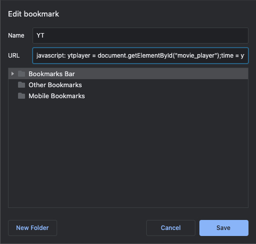

# Shortcuts

These are shortcuts I've added to chrome to make some simple tasks easier:

- `youtube_timestamp` - copies the current YouTube timestamp to the clipboard. 
  - I like to re-upload all my lectures to YouTube and timestamp important parts with notes. This makes grabbing the time easy.

- `dl_mymedia` - creates a link that allows for easy video downloads from the uToronto's MyMedia.

- `dl_bbco` - creates a link that allows for easy video downloads from Blackboard Collaborate.

- `dl_canvas` - creates a link that allows for easy media downloads from UBC's Canvas
  - *received a request to make something compatible with UBC's student platform*

