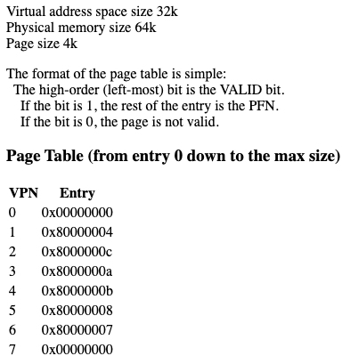

# Virtual Address Translation

This is a virtual address translation tool. It performs the translation from a virtual address to a physical one, for some dummy memory examples which asks you to perform a virtual address trace.

This might look something like this:



## Setup

This C script requires setting up some given file system properties in `vaddr_input.h` to function. Namely, the sizes of the virtual address space (`VADDR_SIZE`), the physical memory size (`PHYS_MEMSIZE`), and the page size (`PAGE_SIZE`). Then, the dummy page virtual number entries (`VPNENTRY`).

```
int VADDR_SIZE = 32 * 1024;
int PHYS_MEMSIZE = 64 * 1024;
int PAGE_SIZE = 4 * 1024;

unsigned int VPNENTRY[8] = {
  0x00000000,
  0x80000004,
  0x8000000c,
  0x8000000a,
  0x8000000b,
  0x80000008,
  0x80000007,
  0x80000000
};
```

## Run

After setup, compile the C code with a `make`, then, in the terminal, run the script with two args: the virtual address, and the base that it is input as.

In our example, `./vaddr 0x128a 16` is used for this virtual address in base 16 (hex, as is evident by the prefix `0x`).

## Output

The resulting output shows the values at each stage up to the final physical address. It is a little verbose, but does so to provide enough info and numbers to allow one to check each step thoroughly.

For this example, the virtual address of `0x128a` is translated to a physical address of `0x428a`.

```
Num Offset Bits: 12 
Num Virtual Pages: 8 
Num Index Bits (VPages): 3 
Num Physical Pages (Page Frames): 16 
Num Index Bits (PPages): 4 
Num Physical Address Bits: 16 
----------------------------------------------------------------
VADDR: 128a 
num:  4746 (0x128a)
bits: 0001 0010 1000 1010 

Page Offset: 
num:  650 (0x28a)
bits: 0010 1000 1010 

Page Number: 1

FRAME_ENTRY: 
num:  -2147483644 (0x80000004)
bits: 1000 0000 0000 0000 0000 0000 0000 0100 

Frame Check: 0x8 (0x8 is good)
num:  8 (0x8)
bits: 1000 

Frame Num: 
num:  4 (0x4)
bits: 0100 

Physical Address: 
num:  17034 (0x428a)
bits: 0100 0010 1000 1010 
```